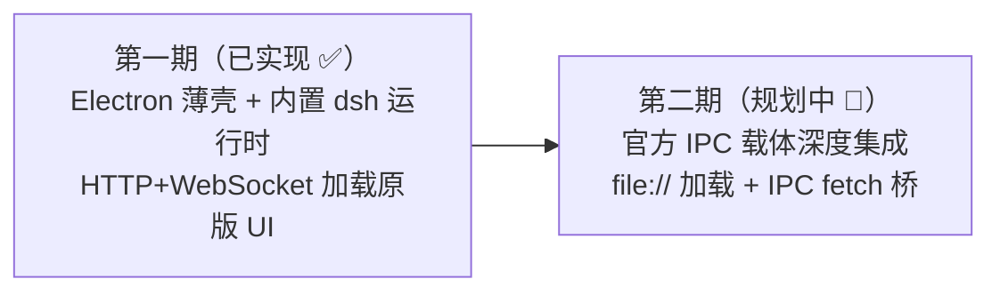
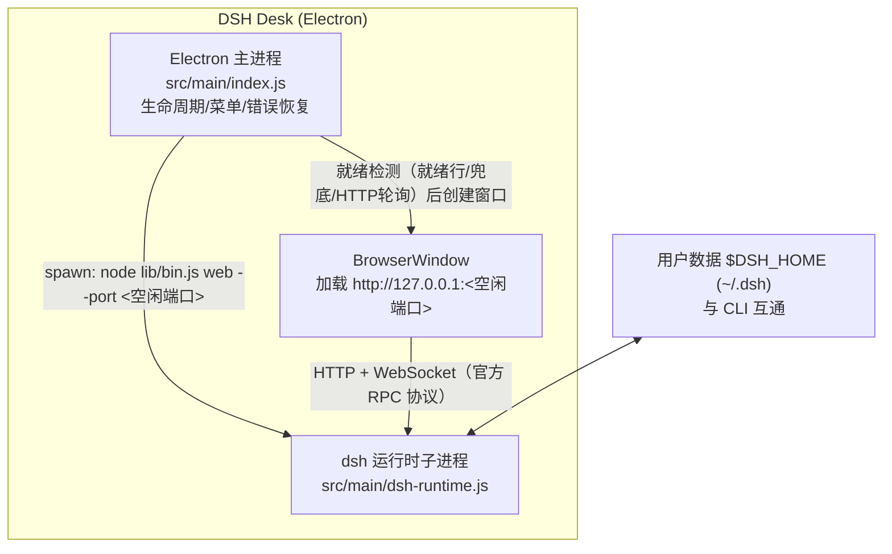
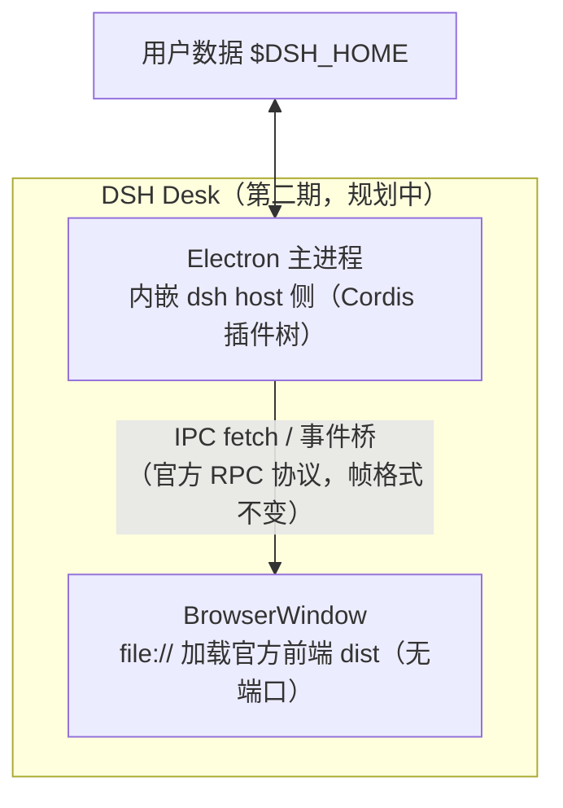

# DSH Desk
[](LICENSE)
[](https://github.com/volcanicll/dsh-desk)
[](https://nodejs.org)
[](https://www.electronjs.org)

将 [DeepSeek Harness](https://github.com/deepseek-ai/deepseek-harness)（`dsh`）封装为桌面端应用的 **Electron 薄壳**实现（productName: `DSH Desk`）。

> 核心原则：**不改动 dsh 的任何前端代码**。桌面端启动官方 `dsh web` 运行时并加载原版 Web UI，所有原始界面与交互（会话、工作区、工具调用、审批、插件管理、模型配置等）100% 原样保留。

<p align="center">
  
</p>

## 目录

- [功能特性总览](#功能特性总览)
- [文档导航](#文档导航)
- [方案总览：第一期与第二期](#方案总览第一期与第二期)
- [第一期（已实现）：Electron 薄壳 + 内置 dsh 运行时](#第一期已实现electron-薄壳-内置-dsh-运行时)
- [第二期（规划中）：官方 IPC 载体深度集成](#第二期规划中官方-ipc-载体深度集成)
- [快速开始（开发模式）](#快速开始开发模式)
- [与官方（npm 发布版）保持同步](#与官方npm-发布版保持同步)
- [构建安装包](#构建安装包)
- [验证](#验证)
- [平台注意点](#平台注意点)
- [贡献](#贡献)
- [许可](#许可)

## 功能特性总览

| 维度 | 第一期（已实现 ✅） | 第二期（规划中 🚧） |
|---|---|---|
| 进程模型 | 双进程：Electron 主进程 + dsh 运行时子进程 | 单进程：dsh host 侧内嵌主进程 |
| 前端加载 | `http://127.0.0.1:<空闲端口>` | `file://`（无端口） |
| 通信载体 | HTTP + WebSocket（官方 RPC 协议） | IPC fetch 桥（官方 RPC 协议不变） |
| 原版 UI | 100% 原样保留 | 100% 原样保留（仅换传输层） |
| 自包含打包 | ✅ 内置 Node + dsh 依赖树 | 同左 |
| 数据互通（`$DSH_HOME`） | ✅ 与 CLI 无缝共享 | 同左 |
| 上游同步（npm 发布版） | ✅ 一键检测/升级/验证 | 同左 |

## 文档导航

| 文档 | 说明 |
|---|---|
| [docs/architecture.md](docs/architecture.md) | 架构设计：进程模型、启动时序、安全边界、容错与自测 |
| [docs/development.md](docs/development.md) | 开发指南：环境、脚本参考、验证与调试 |
| [docs/release.md](docs/release.md) | 发布与打包：构建、签名公证、发布清单、CI |
| [docs/upstream-sync.md](docs/upstream-sync.md) | 上游同步与版本管理 |
| [docs/troubleshooting.md](docs/troubleshooting.md) | 故障排查：常见问题与诊断信息收集 |
| [CONTRIBUTING.md](CONTRIBUTING.md) | 贡献指南 |
| [CHANGELOG.md](CHANGELOG.md) | 变更记录 |

## 方案总览：第一期与第二期



| 对比项 | 第一期（Plan A） | 第二期（Plan B） |
|---|---|---|
| **状态** | 已实现并验证 | 规划中，未实现 |
| **形态** | 官方 `dsh web` 运行时 + 薄壳 | 官方预留的 Electron 形态（IPC 载体） |
| **改动前端** | 零改动 | 零改动（仅替换传输层） |
| **端口** | 自选空闲端口 | 无端口 |
| **子进程** | dsh 独立子进程 | 无（host 侧同进程） |
| **实现成本** | 低（已完成） | 中高（需实现官方尚未提供的 IPC 载体） |
| **风险** | 低 | 依赖官方约定，需回归验证 |

两期共用同一套能力底座：内置 Node 运行时、`@deepseek-ai/dsh` 捆绑、npm 版本同步机制、三层就绪/健康检测、自测与 CI 门禁。

## 第一期（已实现）：Electron 薄壳 + 内置 dsh 运行时

### 定位

用最小侵入的方式把官方 Web 版变成桌面应用：**壳不做任何前端改动**，只负责"拉起官方运行时 + 提供原生桌面外壳"。这也是当前仓库的默认形态。

### 功能清单

1. **原版 UI 100% 保留**：启动官方 `dsh web` 运行时并加载原版 Web UI；会话、工作区、工具调用、审批、插件管理、模型配置等交互与浏览器版完全一致。
2. **自包含打包**：内置 Node 运行时（`resources/node/`）与 dsh 完整依赖树 + 官方前端 dist（`resources/dsh/`）；目标机器无需安装 Node、无需联网；三平台产物（macOS DMG / Windows NSIS / Linux AppImage）。
3. **数据互通**：复用官方 `$DSH_HOME`（默认 `~/.dsh`），与 `npx @deepseek-ai/dsh web` 完全共享工作区、配置与会话。
4. **原生桌面体验**：独立窗口（1280×860，最小 900×600）、原生菜单（编辑/视图/窗口 role，Web UI 内复制粘贴缩放可用）、单实例锁定（二次启动聚焦已有窗口）、`File → Restart dsh Server`（⌘⇧R / Ctrl+Shift+R）无需重启应用即可重启后端。
5. **三层就绪检测**：官方就绪行 `dsh web: …` → stdout 任意 loopback URL → 自选端口 HTTP 轮询；对上游输出格式变化抗脆，避免误判启动失败。
6. **生命周期与错误恢复**：窗口关闭（非 macOS）即退出并回收子进程；SIGTERM → 5s 后 SIGKILL 兜底，保证 dsh 干净回收；dsh 异常退出时显示友好错误页，支持一键重启。
7. **npm 发布版同步机制**：`package.json → dsh.version` 单一版本来源、`resources/dsh/version.json` 版本记录、`npm run check:update` / `npm run update:dsh` 一键检测/升级/重捆绑/验证。
8. **安全**：`contextIsolation` + `sandbox` + 无 `nodeIntegration`；外链与跨源导航交系统浏览器；子进程禁用遥测（`DSH_TELEMETRY_DISABLED=1`）；仅回环地址监听。
9. **自测与 CI**：`--self-test` GUI 自测（窗口加载 + DOM 诊断 + 可选截图）、`scripts/smoke.mjs` 无 GUI 冒烟（dev/packaged 两种布局）、GitHub Actions smoke 工作流。

### 架构



### 关键设计

- **运行时来源**：开发模式用系统 Node（≥22.19）+ 本地 `@deepseek-ai/dsh`；打包模式用捆绑 Node + 捆绑 dsh；路径解析收敛在纯模块 `dsh-resolve.js`。
- **端口**：先向 OS 申请空闲端口再显式传给 `dsh web --port <port>`，避免与用户自建的 `dsh web`（默认 3080）冲突，且就绪探测不依赖输出格式。
- **就绪与退出**：三层就绪检测（`dsh-common.js`）；60s + 2s 未就绪报错并附 stderr 摘要；退出时 SIGTERM → SIGKILL 兜底。
- 详见 [docs/architecture.md](docs/architecture.md)。

### 验证状态

已在 macOS arm64（dsh `0.1.0-rc.6` / Electron 37.10.3）验证：

- 自选端口启动、三层就绪检测、首页与 SPA 路由 200 ✅
- 开发模式窗口 ~500ms 加载原版 UI ✅
- 打包模式（捆绑 Node + 捆绑 dsh）窗口 ~500ms 加载原版 UI，退出时 dsh code 0 ✅
- `--self-test` DOM 诊断：`title="DeepSeek Harness"`、`root=true` ✅

## 第二期（规划中）：官方 IPC 载体深度集成

### 定位与背景

deepseek-harness 官方架构已为 Electron 预留设计：RPC 协议**通道无关**，`AbstractApiClient` 只需实现 `doFetch` 即可接入新载体；官方 webserver 包注释明确 "Electron loads dist over file:// and carries fetch over an IPC bridge"。第二期即把 dsh host 侧直接运行在 Electron 主进程内，前端 `file://` 加载，RPC 走 IPC 桥——**去掉端口与子进程，仍不改任何前端代码**。

> 依据：官方 `packages/host/webserver/src/index.ts` 注释、`.agents/notes/implemented/architecture/2026-07-19-gui-layering-and-rpc-protocol.zh.md`（"将来的 Electron 应用经由 IPC fetch 载体复用同一套 web client 包"）。

### 功能清单（规划）

1. **单进程运行**：dsh host 侧（Cordis 插件树）内嵌 Electron 主进程，不再 spawn 子进程。
2. **无端口、无本地 HTTP**：前端 `file://` 加载官方 dist，移除回环监听，攻击面更小。
3. **IPC fetch 载体**：实现 `AbstractApiClient.doFetch` 子类（主进程侧 `ipcMain` + preload 桥），协议帧与序列化复用官方 RPC 约定，**换载体不动协议**。
4. **启动更快、资源更低**：省去子进程启动与 HTTP 建连开销。
5. **原 UI 与交互不变**：仍加载官方前端 dist，会话/工作区/工具/审批等交互与第一期一致（回归以 `--self-test` + 手工清单验收）。
6. **保留一期全部能力**：自包含打包、`$DSH_HOME` 数据互通、npm 版本同步、错误恢复、自测与 CI。
7. **可选增强（随二期附带）**：应用内下载管理（会话导出）、托盘常驻、自动更新（`electron-updater` 对接 GitHub Release）。

### 架构（示意）



### 实现要点

- **载体接入点**：客户端侧继承 `AbstractApiClient` 只实现 `doFetch`；主进程侧提供 IPC handler 把请求转发到进程内 host 的 API gateway（`dsh-host-apiproxy`），下行事件经 `ipcRenderer` 事件流推送。
- **组合方式**：参考官方 `packages/bundle/web-app/cordis.patch.yml`，新增一个 `electron` profile（或补丁层）：保留 base/host 行，替换 webserver/frontend-static 传输行，挂接 IPC 载体。
- **前端 dist**：继续来自捆绑的 `@deepseek-ai/dsh-web-frontend`，用 `file://` 或自定义协议加载（需处理 SPA 路由与资源路径）。
- **验收标准**：
  - `npm run smoke`（packaged 布局）+ `--self-test` 通过；
  - 原 UI 功能等价（会话、工作区、工具、审批、模型配置手工清单）；
  - `lsof -i` 确认无额外端口监听；退出后无残留进程；
  - `resources/dsh/version.json` 与预期版本一致。

### 状态

🚧 **未实现**。前置依赖：官方 IPC 载体尚无实现，需自行按官方约定实现；建议第一期稳定后、跟随官方发布节奏推进。

## 快速开始（开发模式）

要求：Node.js ≥ 22.19（dsh 的 engines 要求 `^22.19.0 || >=24.0.0`）。

```bash
npm install
npm start            # 启动桌面应用（自动拉起 dsh web --port <空闲端口> 并加载原版 UI）
```

- 菜单 **File → Restart dsh Server**（⌘⇧R / Ctrl+Shift+R）可重启后端，无需重启应用。
- 默认数据目录为 `~/.dsh`（`$DSH_HOME`），与 `npx @deepseek-ai/dsh web` 完全共享。

## 与官方（npm 发布版）保持同步

**同步源 = npm 发布的 `@deepseek-ai/dsh`**（官方包自带完整依赖树 + 构建好的前端 dist），不是克隆官方 git 源码。因此上游发版后，重新捆绑 + 验证即可获得最新 UI 与功能。

```bash
npm run check:update   # 只报告是否有新版
npm run update:dsh     # 有新版时：升级 + 重捆绑 + 验证（幂等，已最新则跳过）
```

| 机制 | 位置 | 说明 |
|---|---|---|
| 版本单一来源 | `package.json → dsh.version` | dev 依赖与打包捆绑使用同一版本，避免漂移 |
| 捆绑版本记录 | `resources/dsh/version.json` | 记录 requested/installed/node/date，启动时打印 `dsh bundle version` |
| 上游更新检查 | `scripts/check-dsh-update.mjs` | 查询 npm latest 并对比当前版本 |
| 一键升级 | `npm run update:dsh` | 更新 package.json → `npm install` → 重新捆绑 → 自动跑验证门禁 |
| 自动验证门禁 | `bundle-dsh.mjs` | 每次捆绑后自动运行 packaged 布局冒烟测试（`--no-verify` 跳过） |

详见 [docs/upstream-sync.md](docs/upstream-sync.md)。

## 构建安装包

```bash
npm run prepare:runtime   # 下载 Node 运行时 + 捆绑 @deepseek-ai/dsh（需网络）
npm run dist:mac          # macOS DMG（arm64 + x64）
npm run dist:win          # Windows NSIS 安装包（x64）
npm run dist:linux        # Linux AppImage（x64 + arm64）
npm run dist              # 当前平台
```

打包后的应用完全自包含：内置 Node 运行时与 dsh 依赖树，目标机器无需安装 Node 或联网。
发布前请在 `electron-builder.yml` 中配置正式 `appId`、开发者证书签名（macOS 公证）与图标；发布清单见 [docs/release.md](docs/release.md)。

## 验证

```bash
# 1) 无 GUI 冒烟：dev 布局
node scripts/smoke.mjs
# 2) 无 GUI 冒烟：packaged 布局（resources 需先 prepare:runtime）
node scripts/smoke.mjs --packaged /path/to/resources-root
# 3) GUI 自测（开发模式）：启动 → 加载原版 UI → 自动退出
npx electron . --self-test
# 4) GUI 自测（打包产物）：
"./release/mac-arm64/DSH Desk.app/Contents/MacOS/DSH Desk" --self-test
# 5) 附带截图（可选）
... --self-test --screenshot /tmp/shot.png
```

更多验证细节与手工验收清单见 [docs/development.md](docs/development.md)。

## 平台注意点

- **Windows**：dsh 的 PowerShell 工具链（pwsh）随依赖树捆绑，但 PowerShell 本体需目标机器支持；建议在 Windows 上跑一次 `scripts/smoke.mjs` 确认。
- **Linux**：dsh 的 `landlock-run` 沙箱组件为 Linux 专用，已在依赖树中按平台安装；AppImage 建议在目标发行版验证。
- **macOS**：首次运行未签名/未公证构建会被 Gatekeeper 拦截，发布前请完成签名与公证。

## 贡献

欢迎提交 [Issue](https://github.com/volcanicll/dsh-desk/issues) 与 PR；提交前请阅读 [CONTRIBUTING.md](CONTRIBUTING.md)，本地验证请先通过 `npm run smoke`。

## 许可

[MIT](LICENSE)。DeepSeek Harness 本体为 MIT（[LICENSE](https://github.com/deepseek-ai/deepseek-harness/blob/main/LICENSE)）。
