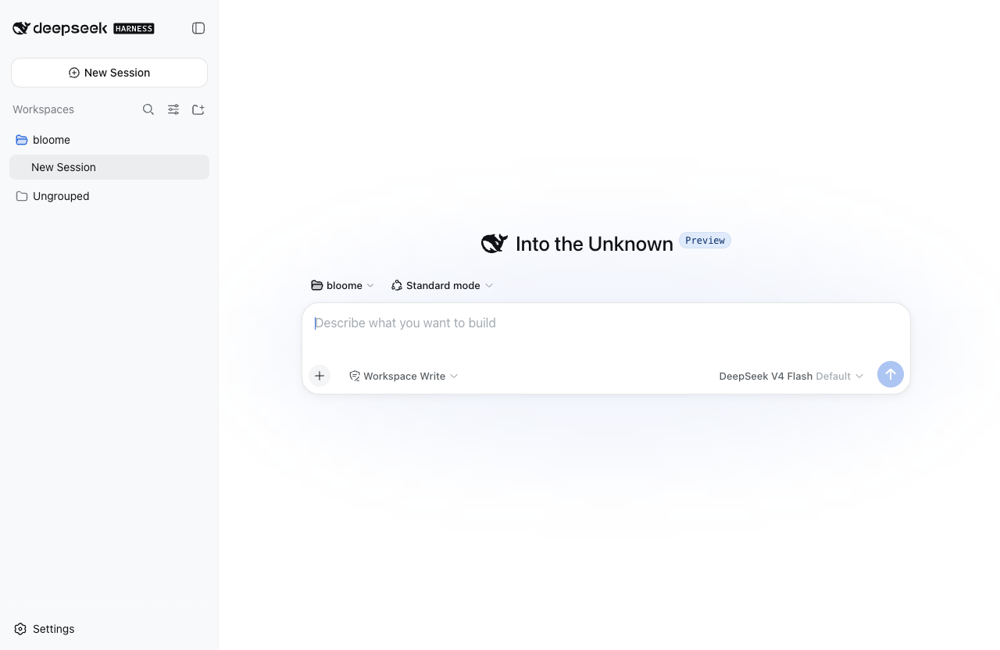

# DSH Desk
[](LICENSE)
[](https://github.com/volcanicll/dsh-desk)
[](https://nodejs.org)
[](https://www.electronjs.org)

将 [DeepSeek Harness](https://github.com/deepseek-ai/deepseek-harness)（`dsh`）封装为桌面端应用的 **Electron 薄壳**实现（productName: `DSH Desk`）。

> 核心原则：**不改动 dsh 的任何前端代码**。桌面端启动官方 `dsh web` 运行时并加载原版 Web UI，所有原始界面与交互（会话、工作区、工具调用、审批、插件管理、模型配置等）100% 原样保留。

<p align="center">
  
</p>

## 特性

- **不改动前端**：启动官方 `dsh web` 运行时并加载原版 Web UI，界面与交互 100% 原样保留
- **原生桌面体验**：独立窗口、原生菜单、错误恢复、单实例锁定
- **自包含打包**：内置 Node 运行时与 dsh 依赖树，目标机器无需安装 Node 或联网
- **数据互通**：复用官方 `$DSH_HOME`，与 CLI 数据无缝共享
- **安全**：`contextIsolation` + `sandbox` + 无 `nodeIntegration`，外链走系统浏览器

## 方案（第一期：Plan A）


- **运行时来源**：开发模式用系统 Node（≥22.19）+ 本地 `@deepseek-ai/dsh`；打包模式用应用内捆绑的 Node 运行时 + 捆绑的 `@deepseek-ai/dsh`（含完整依赖树与官方前端 dist）。
- **端口**：应用先向 OS 申请空闲端口再传给 `dsh web --port <port>`（等价随机端口，避免与用户自建的 `dsh web` 冲突，且不依赖输出格式）。
- **就绪检测**：三层容错——官方就绪行 `dsh web: …`（首选）→ stdout 任意 loopback URL（兜底）→ 自选端口 HTTP 轮询（最后手段）。
- **数据**：复用官方 `$DSH_HOME`，与 CLI 数据无缝互通。
- **安全**：`contextIsolation` + `sandbox` + 无 `nodeIntegration`；外链与跨源导航交由系统浏览器打开。

### 目录结构

```
dsh-desk/
├── src/
│   ├── main/
│   │   ├── index.js        # 应用入口：生命周期、窗口、错误恢复、--self-test
│   │   ├── dsh-runtime.js  # dsh 子进程管理（spawn/就绪/优雅退出）
│   │   ├── dsh-resolve.js  # 运行时路径解析（纯模块，dev/prod 共用）
│   │   ├── dsh-common.js   # 空闲端口选择 + 三层就绪检测（纯模块）
│   │   └── menu.js         # 原生菜单
│   ├── preload/index.js    # 最小化安全桥（仅错误页使用）
│   └── renderer/error.html # 启动失败时的友好错误页（可一键重启）
├── scripts/
│   ├── fetch-node.mjs      # 下载 Node 运行时 → resources/node/<platform>-<arch>/
│   ├── bundle-dsh.mjs      # 安装 @deepseek-ai/dsh → resources/dsh/（含版本记录+验证门禁）
│   ├── check-dsh-update.mjs# 查询 npm latest 并对比/升级 dsh 版本
│   ├── gen-icon.mjs        # 生成应用图标 build/icon.png
│   └── smoke.mjs           # 无 GUI 冒烟测试（dev/packaged 两种布局）
├── build/                  # 图标、entitlements
├── electron-builder.yml    # 三平台打包配置
└── docs/screenshot.png     # 运行效果截图
```

## 快速开始（开发模式）

要求：Node.js ≥ 22.19（dsh 的 engines 要求 `^22.19.0 || >=24.0.0`）。

```bash
npm install
npm start            # 启动桌面应用（自动拉起 dsh web --port <空闲端口> 并加载原版 UI）
```

- 菜单 **File → Restart dsh Server**（⌘⇧R / Ctrl+Shift+R）可重启后端，无需重启应用。

- 默认数据目录为 `~/.dsh`（`$DSH_HOME`），与 `npx @deepseek-ai/dsh web` 完全共享。

## 构建安装包

```bash
npm run prepare:runtime   # 下载 Node 运行时 + 捆绑 @deepseek-ai/dsh（需网络）
npm run dist:mac          # macOS DMG（arm64 + x64）
npm run dist:win          # Windows NSIS 安装包（x64）
npm run dist:linux        # Linux AppImage（x64 + arm64）
npm run dist              # 当前平台
```

打包后的应用完全自包含：内置 Node 运行时与 dsh 依赖树，目标机器无需安装 Node 或联网。
发布前请在 `electron-builder.yml` 中配置正式 `appId`、开发者证书签名（macOS 公证）与图标。

## 与官方（npm 发布版）保持同步

**同步源 = npm 发布的 `@deepseek-ai/dsh`**（官方包自带完整依赖树 + 构建好的前端 dist），
不是克隆官方 git 源码。因此上游发版后，重新捆绑 + 验证即可获得最新 UI 与功能。

版本管理机制：

| 机制 | 位置 | 说明 |
|---|---|---|
| 版本单一来源 | `package.json → dsh.version` | dev 依赖与打包捆绑使用同一版本，避免漂移 |
| 捆绑版本记录 | `resources/dsh/version.json` | 记录 requested/installed/node/date，启动时打印 `dsh bundle version` |
| 上游更新检查 | `scripts/check-dsh-update.mjs` | 查询 npm latest 并对比当前版本 |
| 一键升级 | `npm run update:dsh` | 更新 package.json → `npm install` → 重新捆绑 → 自动跑验证门禁 |
| 自动验证门禁 | `bundle-dsh.mjs` | 每次捆绑后自动运行 packaged 布局冒烟测试（`--no-verify` 跳过） |

```bash
npm run check:update   # 只报告是否有新版
npm run update:dsh     # 有新版时：升级 + 重捆绑 + 验证（幂等，已最新则跳过）
```

### 就绪检测（对上游输出格式变化抗脆）

`src/main/dsh-common.js` 采用三层策略，避免上游改打印文案导致应用误判失败：

1. 官方就绪行 `dsh web: http://127.0.0.1:<port>`（首选）；
2. stdout 中任意 `http://127.0.0.1:<port>` 字面量（兜底）；
3. 自选端口 + HTTP 轮询（最后手段）——应用先向 OS 申请空闲端口再传给 `dsh web --port <port>`，
   即使输出格式全部变化也能探测就绪。

### 上游迭代的影响与应对

- 正常迭代：`npm run update:dsh` 一键同步（UI/功能随 npm 包自动更新，壳零改动）。
- 兼容性变化（CLI flag / 就绪行 / Node engines / 包结构）：验证门禁会暴露问题；
  就绪检测已做容错；Node 版本由 `scripts/fetch-node.mjs`（`DSH_NODE_VERSION`）集中控制；
  `dsh-resolve.js` 路径解析集中在一处，便于按上游结构调整。
- 官方只改源码未发 npm 包：体验滞后但不坏（同步源就是 npm 发布版，符合预期）。

## 验证

```bash
# 1) 无 GUI 冒烟：dev 布局
node scripts/smoke.mjs
# 2) 无 GUI 冒烟：packaged 布局（resources 需先 prepare:runtime）
node scripts/smoke.mjs --packaged /path/to/resources-root
# 3) GUI 自测（开发模式）：启动 → 加载原版 UI → 自动退出
npx electron . --self-test
# 4) GUI 自测（打包产物）：
"./release/mac-arm64/DSH Desk.app/Contents/MacOS/DSH Desk" --self-test
# 5) 附带截图（可选）
... --self-test --screenshot /tmp/shot.png
```

已验证（macOS arm64，dsh 0.1.0-rc.6 / Electron 37.10.3）：
- 自选端口启动、三层就绪检测、首页与 SPA 路由 200 ✅
- 开发模式窗口 514ms 加载原版 UI ✅
- 打包模式（捆绑 Node + 捆绑 dsh）窗口 505ms 加载原版 UI，退出时 dsh 正常退出（code 0）✅

## 平台注意点

- **Windows**：dsh 的 PowerShell 工具链（pwsh）随依赖树捆绑，但 PowerShell 本体需目标机器支持；建议在 Windows 上跑一次 `scripts/smoke.mjs` 确认。
- **Linux**：dsh 的 `landlock-run` 沙箱组件为 Linux 专用，已在依赖树中按平台安装；AppImage 建议在目标发行版验证。
- **macOS**：首次运行未签名/未公证构建会被 Gatekeeper 拦截，发布前请完成签名与公证。

## 二期演进（Plan B，官方预留形态）

deepseek-harness 官方架构笔记已为 Electron 预留设计：`AbstractApiClient` 只需实现 `doFetch` 即可接入新载体，前端 `file://` 加载 + IPC fetch 桥。二期可去掉本地端口与子进程，将 dsh host 侧直接运行在 Electron 主进程内（见 `packages/host/webserver/src/index.ts` 注释与 `.agents/notes/implemented/architecture/2026-07-19-gui-layering-and-rpc-protocol.zh.md`）。

## 贡献

欢迎提交 [Issue](https://github.com/volcanicll/dsh-desk/issues) 与 PR；本地验证请先通过 `npm run smoke`。

## 许可

[MIT](LICENSE)。DeepSeek Harness 本体为 MIT（[LICENSE](https://github.com/deepseek-ai/deepseek-harness/blob/main/LICENSE)）。
